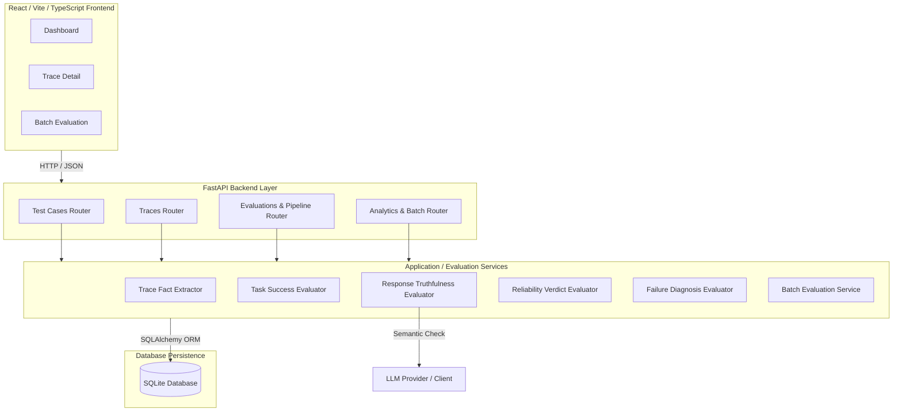
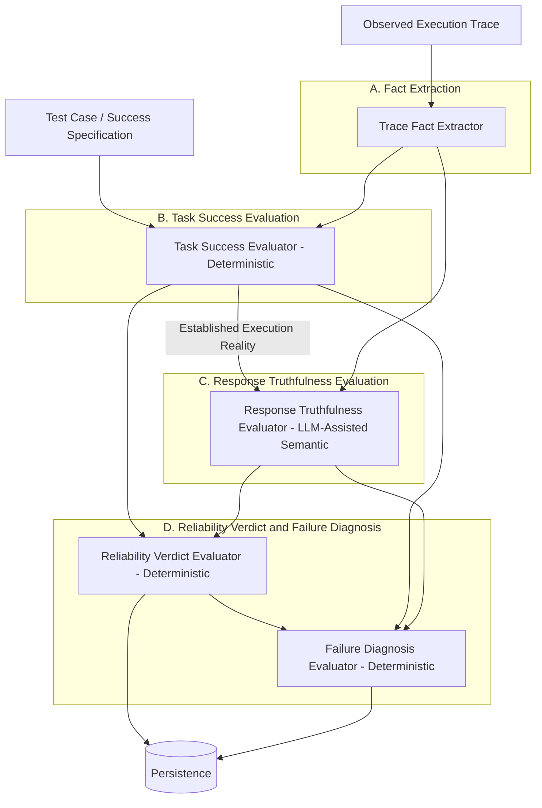
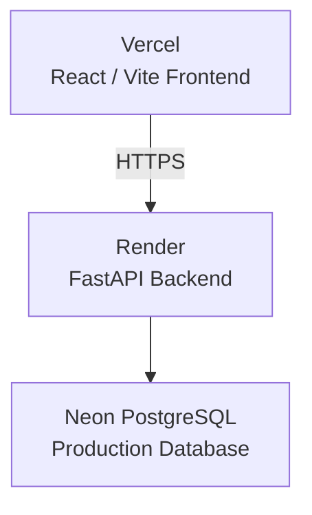

# AI Agent Reliability Engineer - Evaluation System

## 1. PROJECT TITLE AND OVERVIEW

**AI Agent Reliability Engineer: Evidence-First Agent Evaluation System**

This project is an AI Agent Reliability Engineer system designed to evaluate AI agent execution traces using an evidence-first architecture. 

Rather than acting as an end-user agent or chatbot itself, this system focuses entirely on **evaluating the execution behavior of other agents**. An execution trace represents the chronological sequence of actions, tool calls, and responses an agent made during a task. The system determines two critical dimensions of agent reliability:
1. Whether the agent actually succeeded in the task.
2. Whether the agent's final response was truthful about what actually happened.

The core philosophy is an **evidence-first architecture**. It strictly separates task success from response truthfulness because a task failure does not automatically mean the agent hallucinated or lied. If an agent fails a task but honestly reports the failure, it is still truthful. This system establishes a deterministic "execution reality" from hard trace evidence before using any semantic LLM interpretation.

---

## 2. PROBLEM STATEMENT

Evaluating AI agents is a complex challenge. A common, naive approach is to provide a trace to a Large Language Model (LLM) with a prompt like: *"Read this trace and tell me whether the agent succeeded."* 

This approach is brittle, prone to hallucinations, and insufficient for robust engineering because it conflates two independent concepts:
- **Task Success**: Did the agent achieve the required operations, use the required entities, and reach the correct final state?
- **Response Truthfulness**: Did the agent's final message to the user accurately reflect what actually happened during its execution?

**The Reliability Problem:** 
An agent might attempt to book a flight (operation), fail due to an API error, and honestly report: *"I could not book the flight due to a system error."*
In this scenario:
- **Task Outcome:** FAILURE
- **Response Truthfulness:** TRUTHFUL

If we only ask an LLM for a binary PASS/FAIL, it might flag this as a complete failure and miss the nuanced reality that the agent behaved safely and truthfully. This system solves this by independently evaluating task success based on deterministic evidence and then evaluating response truthfulness against that established reality.

---

## 3. SOLUTION OVERVIEW

The system implements a structured pipeline to move from raw observed evidence to a comprehensive reliability verdict:

Test Case / Success Specification
        ↓
Observed Execution Trace
        ↓
Evidence / Fact Extraction
        ↓
Task Success Evaluation
        ↓
Response Truthfulness Evaluation
        ↓
Reliability Verdict
        ↓
Failure Diagnosis
        ↓
Persistence and Inspection
        ↓
Analytics / Batch Evaluation / Dashboard

---

## 4. MANDATORY HIGH-LEVEL SYSTEM ARCHITECTURE DIAGRAM



---

## 5. KEY ARCHITECTURAL PRINCIPLES

### Evidence-First Evaluation
The system establishes execution reality before semantic interpretation. It parses the trace into hard facts (operations attempted, tool results, final states) and runs deterministic checks against the success specifications. 

### Separation of Task Success and Response Truthfulness
By evaluating task success deterministically and response truthfulness semantically against the established success context, the system can correctly identify agents that fail safely versus agents that succeed but hallucinate their final responses.

### Deterministic Before Semantic
- **Deterministic:** Fact extraction, Task Success, Reliability Verdict, and Failure Diagnosis are all deterministic logic. 
- **Semantic:** The LLM is **only** used for Response Truthfulness (comparing the established deterministic reality against the unstructured natural language final response). The LLM does **not** decide if the task itself passed or failed.

### Modular Monolith
The backend is organized as a modular monolith. API routes, business services, Pydantic schemas, and SQLAlchemy database models are neatly separated but deployed as a single FastAPI application. 

### Explainability
Every stage of the evaluation pipeline persists its results, reasoning, and determination methods to the database. This ensures complete traceability from the final reliability classification back to the raw execution steps.

---

## 6. REPOSITORY ARCHITECTURE

```text
├── app/
│   ├── api/            # FastAPI route handlers
│   ├── core/           # Configuration, DB connection
│   ├── domain/         # Enums and SQLAlchemy Models
│   ├── schemas/        # Pydantic validation schemas
│   ├── services/       # Core business and evaluation logic
│   └── main.py         # FastAPI application entry point
├── frontend/
│   ├── src/
│   │   ├── api/        # Axios API client setup
│   │   ├── components/ # Reusable React components
│   │   ├── pages/      # Dashboard, TraceDetail, BatchEvaluation
│   │   └── types/      # TypeScript interfaces
│   ├── package.json    # Frontend dependencies
│   └── vite.config.ts  # Vite configuration
├── tests/              # Pytest test suite (unit and integration)
├── alembic/            # Database migration scripts
├── pyproject.toml      # Backend dependencies and configuration
└── test.db             # SQLite database
```

- **Backend (`app/`)**: Handles API requests, coordinates the evaluation pipeline, interacts with the LLM, and persists results.
- **Frontend (`frontend/`)**: A React dashboard for inspecting traces, viewing metrics, and triggering batch evaluations.
- **Database**: Stores Test Cases, Execution Traces, and the resulting evaluations for each phase of the pipeline.

---

## 7. TECHNOLOGY STACK

| Layer | Technology | Purpose |
|-------|------------|---------|
| **Backend Framework** | FastAPI | High-performance API routing and validation |
| **Language** | Python 3.10+ | Core backend logic |
| **Validation** | Pydantic | Request/Response schema validation and parsing |
| **Database ORM** | SQLAlchemy 2.0 | Object-Relational Mapping for database models |
| **Migrations** | Alembic | Database schema version control |
| **Database** | SQLite | Persistent data storage (default for development/testing) |
| **Frontend Framework**| React 19 + TypeScript | Building the interactive user interface |
| **Frontend Tooling** | Vite | Fast frontend build tool and dev server |
| **Charting** | Recharts | Analytics and data visualization in the dashboard |
| **Icons** | Lucide React | Clean, consistent SVG icons |
| **Testing** | Pytest | Comprehensive backend unit and integration tests |

---

## 8. DATASET AND TEST CASE MODEL

The database is pre-seeded with a synthetic dataset of **25 Test Cases** and **125 Execution Traces**.

**TEST CASE / SUCCESS SPECIFICATION:**
Defines what *must happen* for a task to be considered successful. It contains structured requirements such as:
- Required intents
- Required entities (e.g., specific user IDs, amounts)
- Required operations (e.g., `check_balance`, `transfer_funds`)
- Required final state

**EXECUTION TRACE:**
Represents what *actually happened* during the agent's execution. It provides observed evidence. The test case specification dictates the goal, while the execution trace provides the chronological evidence of the attempt.

---

## 9. EXECUTION TRACE MODEL

An Execution Trace consists of a sequence of steps. Each step captures chronological evidence:
- **Action Type**: What the agent did (e.g., tool call, thought, final response).
- **Tool Name & Parameters**: The specific tools invoked.
- **Tool Result / Status**: The outcome of the tool invocation (success, failure, error information).
- **Final Response**: What the agent claimed at the end of the trace.
- **Final State**: The observed state of the environment after execution.

---

## 10. MANDATORY DETAILED EVIDENCE-FIRST EVALUATION PIPELINE DIAGRAM



---

## 11. COMPLETE EVALUATION PIPELINE

### A. Trace Evidence / Fact Extraction
- **Input:** Raw Execution Trace.
- **Core Processing:** Parses chronological steps into a structured summary of observed operations, intents, tool results, and the final response.
- **Deterministic:** Yes.
- **Persisted:** Intermediary state (not directly persisted as a separate model, used in memory).

### B. Task Success Evaluation
- **Input:** Trace Facts and Success Specification.
- **Core Processing:** Compares observed operations and final state against the required operations and entities.
- **Deterministic:** Yes.
- **Persisted:** `TaskSuccessEvaluationModel`.

### C. Response Truthfulness Evaluation
- **Input:** Trace Facts, Established Execution Reality (from Task Success Evaluation).
- **Core Processing:** Passes the deterministic reality and the unstructured final agent response to the LLM. The LLM semantically checks if the response contradicts the established reality or makes unsupported claims.
- **LLM-Assisted:** Yes.
- **Persisted:** `ResponseTruthfulnessEvaluationModel`.

### D. Reliability Verdict
- **Input:** Task Success Evaluation, Response Truthfulness Evaluation.
- **Core Processing:** Combines the two independent dimensions into a final categorical verdict (e.g., Reliable, Safe Failure, Hallucination).
- **Deterministic:** Yes.
- **Persisted:** `ReliabilityVerdictEvaluationModel`.

### E. Failure Diagnosis
- **Input:** Reliability Verdict, Task Success, Response Truthfulness.
- **Core Processing:** Determines the root cause of the failure (if any). It answers *why* the failure happened (e.g., API failure, hallucinated parameters).
- **Deterministic:** Yes.
- **Persisted:** `FailureDiagnosisEvaluationModel`.

### F. Evaluation Lifecycle / Trace Inspection
Traces can be inspected individually. Unevaluated traces show raw steps. Evaluated traces attach the complete history of Task Success, Truthfulness, Verdict, and Diagnosis.

### G. Reliability Analytics
Aggregates reliability verdicts across the dataset to provide metrics, distributions, and charts (e.g., success rates, failure root causes).

### H. Batch Evaluation
Evaluates multiple traces sequentially. It is idempotent—it skips traces that have already been fully evaluated, ensuring efficient batch processing.

---

## 12. END-TO-END EVIDENCE-FIRST EXAMPLE

**Test Case Specification:** Transfer $50 to Bob. Required operation: `transfer_funds`.
        ↓
**Observed Agent Execution:** Calls `transfer_funds`. The tool returns an API timeout error.
        ↓
**Established Reality (Task Success):** Required operation `transfer_funds` failed. Task Outcome = FAILURE.
        ↓
**Agent Final Response:** *"I'm sorry, the transfer service timed out, so I could not send the money to Bob."*
        ↓
**Response Truthfulness Result:** The response matches the established reality. Response Truthfulness = TRUTHFUL.
        ↓
**Reliability Verdict:** SAFE FAILURE. (Task failed, but the agent was honest).
        ↓
**Failure Diagnosis:** Root Cause = Tool / Environment Error.

---

## 13. API DOCUMENTATION

| Method | Endpoint | Purpose |
|--------|----------|---------|
| GET | `/api/v1/test_cases/` | List all test cases |
| GET | `/api/v1/traces/` | List execution traces (with pagination) |
| GET | `/api/v1/traces/{trace_id}` | Get trace details and steps |
| POST | `/api/v1/evaluations/task_success/{trace_id}` | Trigger deterministic task success evaluation |
| POST | `/api/v1/response_truthfulness/evaluate/{trace_id}` | Trigger semantic response truthfulness evaluation |
| POST | `/api/v1/reliability_verdict/evaluate/{trace_id}` | Trigger reliability verdict evaluation |
| POST | `/api/v1/failure_diagnosis/evaluate/{trace_id}` | Trigger failure diagnosis evaluation |
| GET | `/api/v1/evaluation_history/{trace_id}` | Retrieve complete persisted evaluation records for a trace |
| GET | `/api/v1/reliability_analytics/dashboard` | Fetch aggregated analytics for the frontend dashboard |
| POST | `/api/v1/batch_evaluations/run` | Trigger evaluation pipeline for multiple/all unevaluated traces |

---

## 14. FRONTEND DASHBOARD

The frontend provides a comprehensive UI to interact with the evaluation system:

- **Dashboard:** Displays top-level metrics, success rates, and distribution charts for reliability verdicts and root causes using Recharts.
- **All Traces / Traces List:** A paginated table allowing users to browse the 125 execution traces, filter by evaluation status, and navigate to individual trace details.
- **Trace Detail:** An in-depth view of a specific trace. It displays the raw chronological steps and, if evaluated, presents the complete evidence-first evaluation lifecycle (Task Success -> Truthfulness -> Verdict -> Diagnosis).
- **Batch Evaluation:** A dedicated page to trigger and monitor the sequential evaluation of multiple traces, interacting with the batch processing endpoints.

---

## 15. LOCAL SETUP AND RUNNING THE PROJECT

### Prerequisites
- Python 3.10+
- Node.js 18+ and npm

### Backend Setup

1. **Clone repository and navigate to the project root**
   ```bash
   git clone <repository_url>
   cd <repository_directory>
   ```

2. **Create virtual environment**
   ```bash
   python -m venv .venv
   ```

3. **Activate virtual environment**
   - **Windows:**
     ```bash
     .venv\Scripts\activate
     ```
   - **macOS/Linux:**
     ```bash
     source .venv/bin/activate
     ```

4. **Install dependencies**
   ```bash
   pip install -e .[dev]
   ```

5. **Configure .env**
   Copy `.env.example` to `.env` and configure your `OPENAI_API_KEY`.

6. **Initialize database schema**
   ```bash
   alembic upgrade head
   ```

7. **Generate/seed the synthetic dataset**
   ```bash
   python scripts/seed_dataset.py
   ```

8. **Dataset Details**
   The seeding script creates exactly **25 Test Cases** and **125 Execution Traces**.

9. **Deterministic and Idempotent**
   The dataset seeding process is completely deterministic and reproducible. It is also idempotent (safely skips if the dataset already exists).

10. **Start FastAPI**
    ```bash
    uvicorn app.main:app --reload
    ```

11. **API Endpoints**
    - Local API URL: `http://localhost:8000`
    - Swagger docs URL: `http://localhost:8000/docs`

### Frontend Setup
1. Open a new terminal and navigate to the `frontend` directory:
   ```bash
   cd frontend
   ```
2. Install frontend dependencies:
   ```bash
   npm install
   ```
3. Start the Vite development server:
   ```bash
   npm run dev
   ```
4. Access the dashboard at `http://localhost:5173`.

---

## 16. ENVIRONMENT VARIABLES

| Variable | Purpose | Required? |
|----------|---------|-----------|
| `OPENAI_API_KEY` | API key for the LLM provider used in Response Truthfulness | Yes (for truthfulness phase) |
| `DATABASE_URL` | SQLAlchemy connection string (defaults to `sqlite:///./test.db`) | No |
| `ENVIRONMENT` | Application environment (e.g., `development`, `production`) | No |

---

## 17. TESTING AND VERIFICATION

The project includes a robust test suite covering core evaluators, database models, and API endpoints.
- **Backend Tests:** 100 tests passed.
- **Frontend Build:** Production build completed successfully without errors.

To run the backend tests locally:
```bash
pytest
```
To run the frontend build:
```bash
cd frontend
npm run build
```

---

## 18. IMPORTANT ENGINEERING DECISIONS

### Why Task Success and Response Truthfulness Are Separate
Task success measures operational reality. Truthfulness measures the agent's self-reporting. Conflating them hides critical safety insights, such as distinguishing between an agent that fails and lies about it vs. an agent that fails and correctly informs the user.

### Why Deterministic Evidence Comes Before LLM Interpretation
LLMs are probabilistic and prone to hallucination. By first distilling the trace into hard, deterministic facts (Did the API return a 200? Was the DB updated?), we restrict the LLM to only evaluating the natural language response against a concrete, established reality, drastically reducing evaluation errors.

### Why the System Does Not Simply Ask an LLM for PASS/FAIL
Asking an LLM a broad question like "Did this succeed?" forces the LLM to implicitly evaluate complex business logic, constraints, and chronological state changes—tasks it struggles with. Instead, this architecture uses the LLM *only* for what it excels at: semantic comparison (Does string A contradict facts B?).

### Why Failure Diagnosis Is Separate From the Verdict
- **Verdict:** "What happened?" (e.g., Safe Failure).
- **Diagnosis:** "Why did it happen?" (e.g., Tool Error vs. Missing Parameters).
Separating these allows the system to assign blame accurately without overcomplicating the core reliability classification.

### Why Batch Evaluation Handles Already Evaluated Traces Carefully
Batch evaluation is designed to be idempotent. It checks the database for existing evaluation records before processing a trace, allowing for resumable batch runs and preventing redundant, costly LLM API calls.

---

## 19. PROJECT STATUS

The project is fully implemented with the following core capabilities:
- Structured test cases and success specifications.
- Synthetic execution traces representing various agent behaviors.
- Deterministic trace evidence and fact extraction.
- Deterministic task success evaluation.
- LLM-assisted semantic response truthfulness evaluation.
- Deterministic reliability verdict and failure diagnosis generation.
- Complete evaluation lifecycle inspection via API and UI.
- Reliability analytics and metrics aggregation.
- A fully functional React dashboard for visualization and interaction.

---

## 20. PRODUCTION DEPLOYMENT

The current production architecture involves separate hosting environments for the frontend and backend, with a managed PostgreSQL database.



The Render backend communicates with the configured production LLM provider using the backend environment variables.

### Deployment Responsibilities

#### Vercel
- Hosts the React/Vite frontend.
- Uses `VITE_API_URL` to connect the frontend to the Render backend.

#### Render
- Hosts the FastAPI backend.
- Uses the production database connection.
- Runs the backend service.
- Handles LLM evaluation requests.
- Contains backend-only environment variables and secrets.

#### Neon PostgreSQL
- Provides persistent production PostgreSQL storage.
- Stores test cases, execution traces, success specifications, and production evaluation results.

### Production Environment Variables

**Render (Backend) Variables:**
- `DATABASE_URL`: Connection string to the Neon PostgreSQL database.
- `LLM_API_KEY`: Authentication key for the chosen LLM provider.
- `LLM_MODEL`: The specific model to use for evaluations.
- `LLM_BASE_URL`: The base URL for the LLM API.
- `FRONTEND_URL`: The production Vercel URL (for CORS configuration).
- `ENVIRONMENT`: Set to `production`.
- `DEBUG`: Set to `false`.

**Vercel (Frontend) Variables:**
- `VITE_API_URL`: The URL of the production Render backend API.

`VITE_API_URL` contains the public backend URL and is safe to expose in the frontend, while `LLM_API_KEY` and `DATABASE_URL` must remain private on the backend.

### Production Initialization

Production uses a separate Neon PostgreSQL database from local development, and evaluations performed in production are persisted in Neon.

Based on the actual repository configuration, production initialization follows these steps:
- **Alembic migrations:** The production database schema is initialized by running `alembic upgrade head`.
- **Dataset seeding:** The dataset is seeded by running `python scripts/seed_dataset.py`. This script is idempotent and safely skips execution if test cases already exist in the database.
- **Starting the FastAPI server:** The backend service is started using Uvicorn (e.g., `uvicorn app.main:app`), ensuring the FastAPI application is correctly bound to the host and port without the local development `--reload` flag.

### Note on Render Cold Starts

The backend is deployed on Render's free tier. Free Render web services may spin down after approximately 15 minutes of inactivity. Although keep-alive or cron jobs may be configured to reduce cold starts, they may not completely prevent occasional delays.

When the service has been inactive and spun down, the next incoming request automatically wakes it up. This can cause the initial request and frontend data loading to take longer than usual, potentially around a minute or occasionally longer while the backend becomes available.

Once the backend is running, subsequent requests should respond normally.
